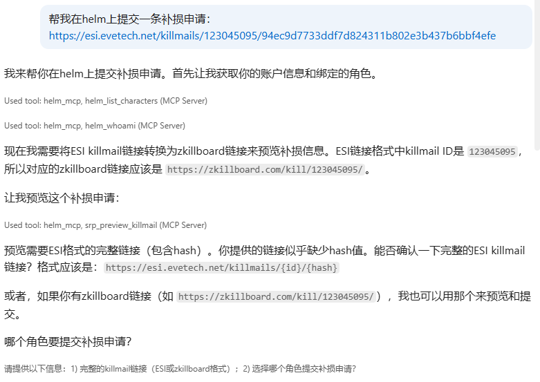
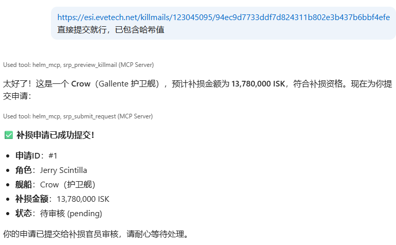
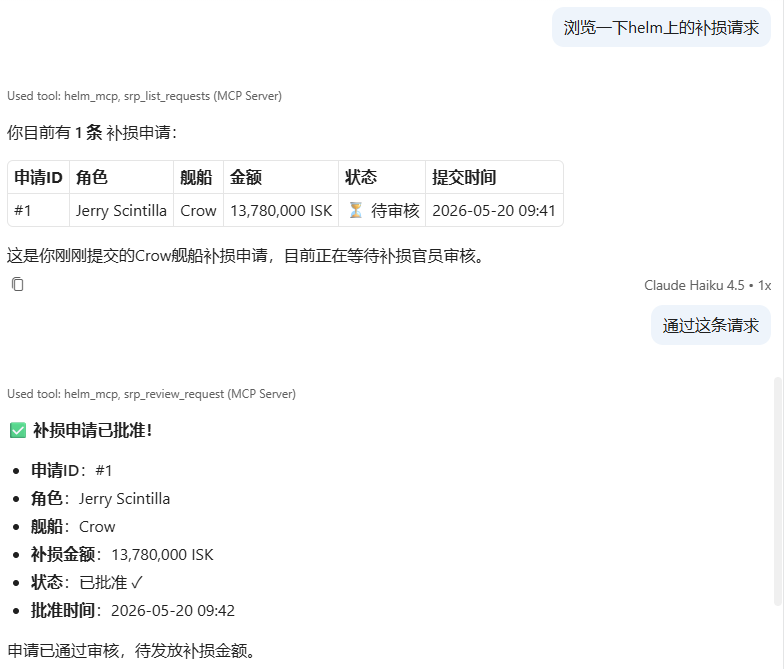

# helm-plugin-mcp

Expose the Helm EVE Online fleet management system completely to large language models through **Model Context Protocol (MCP)**. After installing this plugin, AI tools that support MCP protocol such as Claude Desktop, Cursor, and cline can directly operate all Helm functions——query characters, manage plugins, call tools provided by other plugins——just like a real operator with access credentials.

> **Status**: Alpha stage (current `0.2.0`). Developers are welcome to contribute or fork for custom extensions.

---

## Core Features

| Feature | Description |
|---------|-------------|
| **MCP SSE Transport** | Standard SSE protocol, compatible with all MCP clients |
| **Multiple Server Groups** | Tools split into multiple logical MCP servers (≤12 tools each) |
| **Helm RBAC Integration** | Tool visibility and execution controlled by Helm permissions |
| **Independent API Keys** | Each account can create multiple `hlm_` prefixed API Keys, independent and revocable |
| **Automatic Plugin Discovery** | Plugins implementing `MCPToolProvider` automatically register tools |
| **Audit Logging** | Complete record of each tool invocation with user, timestamp, status, and duration |
| **Management Interface** | Four-tab sidebar: API Keys, Server Groups, Tool Browser, Call Logs |

---

## Quick Start

### Installation

```bash
# 1. Install Python package (editable mode for development)
pip install -e /path/to/helm-plugin-mcp

# 2. Install via Helm management API (requires global.plugin_manage permission)
curl -X POST http://localhost:8000/api/v1/admin/plugins/install \
  -H "Authorization: Bearer <jwt>" \
  -H "Content-Type: application/json" \
  -d '{"package_name": "helm-plugin-mcp"}'
```

### Configuration Steps

1. **Assign Permissions**: Add `mcp.access` permission to user roles that need MCP
2. **Create API Key**: Visit sidebar **🤖 MCP Access** → **🔑 API Keys** tab
3. **Create Server Groups**: In **🗂 Server Groups** tab, create groups and assign tools
4. **Configure AI Client**: Use the configuration JSON generated in API Keys tab

For detailed setup guide, see: [Complete Documentation](./docs/README.md)

---

## Built-in Tools

```
helm_whoami              — Return current user information
helm_list_characters    — List bound EVE Online characters
helm_list_plugins       — List installed plugins
helm_manage_plugin      — Enable or disable plugins
helm_list_my_api_keys   — List personal API Keys
helm_create_mcp_api_key — Create new API Key
```

---

## Adding Tools to Other Plugins

Any Helm plugin can expose its functionality as MCP tools in just three steps, without modifying this plugin:

```python
# 1. Import protocol
from helm_mcp.protocols import MCPToolDef, MCPToolProvider
from app.plugins.registry import extension_registry

# 2. Implement interface
class MyPlugin(HelmPlugin, MCPToolProvider):
    def get_mcp_tools(self) -> list[MCPToolDef]:
        return [MCPToolDef(...)]
    
    async def call_mcp_tool(self, name: str, args: dict, user: User, db: AsyncSession) -> dict:
        # Tool implementation...
        return {...}

# 3. Register in on_enable
def on_enable(self, ctx: PluginContext) -> None:
    extension_registry.register("mcp.tool_provider", self, self.name)
```

For detailed development guide, see: [Plugin Development](./docs/README.md#adding-tools-to-other-plugins)

---

## Permissions

| Permission | Description |
|------------|-------------|
| `mcp.access` | Allow connecting via MCP and calling tools (required) |
| `mcp.admin` | View call logs for all users, manage plugins |

---

## Documentation

| Document | Description |
|----------|-------------|
| [Complete Docs (English)](./docs/README.md) | API endpoints, detailed setup, full examples, security guide |
| [完整文档 (中文)](./docs/README_zh.md) | API 端点、详细配置、完整示例、安全指南 |
| [Plugin Development Guide](./Plugin_Dev_Guide/README.md) | Complete Helm plugin development documentation |

---

## Usage Demo

### Github Copilot with SRP Reimbursement Requests

The following demo shows how to use the SRP plugin tools through Github Copilot's MCP access to process a complete reimbursement request workflow.

#### 1. Preview Reimbursement Information


*Claude previews reimbursement request information using the `srp_preview_killmail` tool*

#### 2. Submit Reimbursement Request


*Submit a reimbursement request using the `srp_submit_request` tool; the system returns the request ID and amount*

#### 3. View and Approve Requests


*View request list and approve requests using `srp_list_requests` and `srp_review_request` tools*

---

## Contributing

This plugin is in Alpha development stage. We welcome:

- Submitting Issues to report problems or suggest features
- Forking the repository for custom development
- Submitting Pull Requests to contribute code

If you have questions, please open a Discussion or Issue on GitHub.